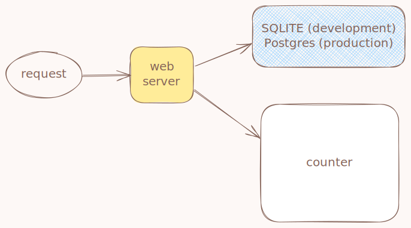
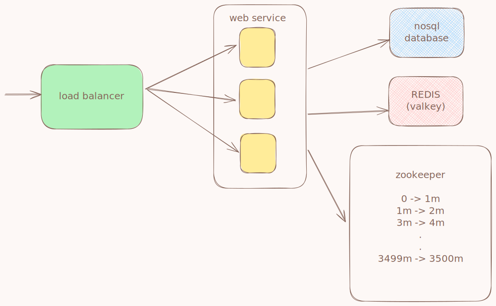

# URL Shortener Service

A URL shortening service built with Ruby on Rails. This service provides a simple API to convert long URLs into short, manageable links with built-in expiration and comprehensive error handling.
**In this project I assumed the following**
1. we need to be able to generate at least 3.5 billion.
2. we should use url safe chars only [A..Z], [a..z], [0..9].
3. so, i decided to go with a base62 charset.
4. so, the domain of the generated shorten links should be at least 62^7 = 3.5216146e+12 links.
5. and since we want to have guranteed uniqness i decided to use a counter approach instead of the just using a randomization algorithm, which will help us gurantee uniqness and monitor our links pool capacity easily.
6. but using a counter approach to generate the shortlinks might be prune to security attacks since attackers might try to guess the next url based on the current ones, so i decided to add another 2 random chars as a salt.
7. the total short link size now is 9 chars .

## Project Architecture



*The architecture diagram above illustrates the complete system components.*

## Features

### Core Functionality
- **URL Encoding**: Convert long URLs into short, memorable links.
- **URL Decoding**: Expand short links back to original URLs.
- **Link Expiration**: Configurable expiration dates (default: 1 year).
- **Unique ID Generation**:  counter system with Base62 encoding.
- **Security**: Salt-based randomization for additional security.

### Technical Features
- **RESTful API**: Simple POST endpoints for encoding and decoding.
- **Comprehensive Validation**: URL format validation and length limits.
- **Error Handling**: Custom exception classes for different error scenarios.
- **Database Optimized**: Indexed short links for fast lookups.
- **Docker Ready**: Containerized for easy deployment and scaling.
- **Test Coverage**: Comprehensive test suite with integration tests.

## Architecture Overview

The application follows a clean, modular architecture:

### Data Layer
- **Link Model**: Stores original URLs, short codes, and expiration dates.
- **SafeCounter Model**: Manages unique ID generation.
- **Database**: SQLite for development, PostgreSQL for production.

### Service Layer
- **UrlShortener**: Core business logic for encoding/decoding.
- **Counter**: Generates unique sequential numbers for short codes.
- **Base62**: Converts numbers to Base62 representation (A-Z, a-z, 0-9).

### API Layer
- **LinksController**: Handles HTTP requests and responses.
- **Custom Exceptions**: Structured error handling for various scenarios.
- **Parameter Validation**: Input sanitization and validation.

### Short Link Generation Process [encode]
1. **Counter Generation**: get current counter value and increment it.
2. **Base62 Encoding**: Convert counter to Base62 string.
3. **Salt Addition**: Add random characters for security.
4. **Link Creation**: Store in database with expiration date.

### Long Link Retreval Process [decode]
1. **get it from database**: get the the long_link from the database table using the table index.

## API Endpoints

### Encode URL
```bash
POST /encode
Content-Type: application/json

{
  "original_link": "https://example.com/very/long/url/with/parameters"
}
```

**Response:**
```json
{
  "short_link": "https://shorten.com/ABC123DEF",
  "expiry_date": "2025-07-10T19:06:43.000Z"
}
```

### Decode URL
```bash
POST /decode
Content-Type: application/json

{
  "short_link": "https://shorten.com/ABC123DEF"
}
```

**Response:**
```json
{
  "original_link": "https://example.com/very/long/url/with/parameters",
  "expiry_date": "2025-07-10T19:06:43.000Z"
}
```

## Configuration

The application supports several environment variables for customization:

- `BASE_URL`: Base URL for short links (default: "https://shorten.com").
- `SHORTEN_URL_SIZE`: Length of short codes (default: 9).
- `SECURITY_SALT_SIZE`: Size of random salt (default: 2).
- `RAILS_ENV`: Rails environment (development/production/test).

## Quick Start
check instructions file called ./HOW_TO_RUN.md

## Error Handling

The API provides detailed error responses for various scenarios:

- **400 Bad Request**: Missing required parameters.
- **422 Unprocessable Entity**: Invalid URL format or database errors.
- **404 Not Found**: Short link not found.
- **410 Gone**: Link has expired.

## Security Features [to mitigate potential attack vectors]

- **Input Validation**: All URLs are validated for format and length.
- **Salt-based Randomization**: Additional security through random salt to avoid guessing attacks (2 random base62 chars).
- **Expiration Management**: Automatic link expiration (1 year).
- **SQL Injection Protection**: ActiveRecord ORM with parameterized queries.

## How We Can Make This Application Scallable Without Issues



- **Horizontally Scalling**: first thing we need is to support having more than just a single web server, and this can be acheived by adding a **load balancer** layer and connect it to multiple thread-safe web servers.

- **Avoiding Collisions**: since the current architecture uses a counter based approach to generate the short links, we need to make sure that the counter increment process is therad-safe. We can use distributed locks here using redis, but this will add a delay to our service and will slow it down, a better solution to this issue will be to make sure that each web server uses a different sub-domian of the counter total domain.....and to acheive this goal we will need to use a **zookeeper** and he will be responsible of:
    - assigning different unused sub-domains for each new server.
    - and once the server finishes its sub-domain , the zookeeper should assign a new unused sub-domain for it.
    -   and if a server went down, the zookeeper will make sure no other server will use its sub-domain.

- **DataBase Scalability**: since our data size here is huge (in billions), using a normal ACID database like postgress, mariadb or mysql will be very challenging here, and even if we went and sharded our database, it will still struggle to handle such high load like 1000 write per second and 5k reads per second. A better decision here will be to use a NOSQL database like **DynamoDB** since it is highly scalable and supports high throughput and it's key-value based.

- **Read Latency**: although DynamoDB will offer lots of gain in our case, but when the system grows we might face some slight challenges, and to avoid that, we should cached the hot-links (most recent and most used) in a distributed in-memory datastore like **REDIS** with cluster mode enabled or **Valeky**.

- **Counter Maxed**: although our counter now have a big range (3.5 billion), it still can be maxed so we should have observability on the zookeeper used sub-domains percentage, and if it exceeded a critical percentage like 90%, we should start taking an action:
    - we can reuse our very old expired domains, but this is not always the best solution since it can be affected by multiple factors and have lots of challenges.
    - we can have a multi-size short links generation approach and use a multi tier scheme to assign those sizes
        - **VIP Enterprise Customers**: can generate 5-chars short-links
        - **Enterprise Customers**: can generate 6-chars short-links
        - **Plus Indviduals**: can generate 7-chars short-links
        - **Free**: can generate 8-chars short-links
    - we can add a versioning scope param to the short links, ex. https://www.shorten.com/v1/aaaasdg
    - we can use a combination of the above solutions.